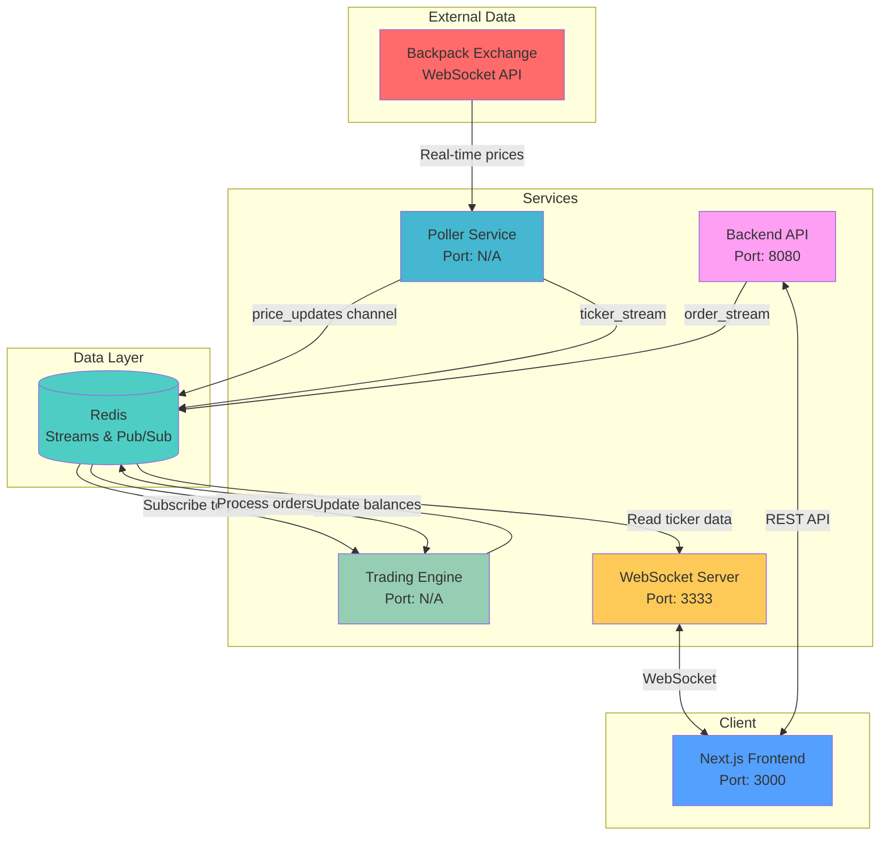

# Tradeless - CFD Trading Platform

A **Turborepo monorepo** implementing a Contract for Difference (CFD) trading platform for cryptocurrency with microservices architecture.

## Project Architecture Overview

This project is a CFD trading platform that simulates cryptocurrency trading without actual asset ownership. Users trade on price movements using an internal ledger system with real-time market data from external exchanges.

### **Root Structure**

- **Monorepo Management**: Turborepo with Bun package manager
- **Workspaces**: `apps/*` and `packages/*`
- **Languages**: TypeScript throughout
- **Infrastructure**: Redis for data streaming and caching

---

##  **Core Applications (`apps/`)**

### 1. **Backend** (`apps/backend/`) - Main API Server

- **Port**: 8080
- **Framework**: Express.js with TypeScript
- **Features**:
  - Authentication system with JWT and email verification
  - Order management endpoints
  - Redis integration for user balance persistence
  - CORS enabled for frontend communication

**Key Components**:

- `routes/auth/`: Email-based authentication with token verification
- `routes/order/`: Trading order placement and user info retrieval
- `redis/`, `mailthing/`, `tokenthing/`: Supporting services
- `validations/`: Input validation with Zod

### 2. **Engine** (`apps/engine/`) - Trading Engine

- **Core Function**: Real-time order processing and price management
- **Data Sources**:
  - Price updates from Redis Pub/Sub
  - Order stream from Redis Streams
- **Features**:
  - In-memory price tracking for BTC, ETH, SOL
  - Order validation (slippage, balance checks)
  - User balance management with precision handling
  - Order execution with risk management

**Key Components**:

- `order/`: Order processing logic with slippage protection
- `types.ts`: Type definitions for orders, assets, and user data

### 3. **Poller** (`apps/poller/`) - Market Data Provider

- **Data Source**: Backpack Exchange WebSocket
- **Assets**: SOL_USDC, ETH_USDC, BTC_USDC
- **Function**:
  - Subscribes to real-time market data
  - Calculates mid-prices from bid/ask spreads
  - Publishes to Redis streams every 100ms
  - Feeds both price updates and ticker streams

### 4. **WebSocket Server** (`apps/ws_server/`) - Real-time Client Communication

- **Port**: 3333
- **Protocol**: WebSocket
- **Features**:
  - Subscription management per client
  - Real-time ticker data streaming
  - Asset-specific subscriptions (BTC, ETH, SOL)

### 5. **Frontend** (`apps/my-app/`) - Next.js Client

- **Framework**: Next.js 16.0.0 with React 19
- **Styling**: Tailwind CSS v4
- **Purpose**: Trading interface (implementation pending)

---

## **Shared Packages (`packages/`)**

### Configuration Packages

- **`eslint-config/`**: Shared ESLint configurations
- **`typescript-config/`**: Shared TypeScript configurations
- **`ui/`**: Shared React component library (Button, Card, Code components)

### Testing

- **`tests/`**: Comprehensive engine testing with Bun test framework
  - Price update validation
  - Order placement scenarios
  - Slippage protection testing
  - Balance management verification

---

## **System Architecture**



### **Data Streams**:

1. **Price Updates**: `price_updates` channel (Pub/Sub)
2. **Order Stream**: `order_stream` key (Streams)
3. **Ticker Stream**: `ticker_stream` key (Streams)
4. **User Balances**: `balances:${userId}` keys (Key-Value)

---

## **CFD Trading Logic**

### **Platform Features**:

- **Assets**: BTC, ETH, SOL CFDs (no actual crypto ownership)
- **Initial Balance**: $5,000 virtual USD per user
- **Settlement**: Internal ledger system - no real crypto transactions
- **Price Source**: Live market data from Backpack Exchange
- **Risk Management**: Slippage protection, balance validation
- **Position Types**: Long positions (buy CFDs on price increase)

### **Trading Flow**:

1. User places CFD order through REST API
2. Engine validates balance and slippage against real market prices
3. Internal ledger updated (no actual crypto bought/sold)
4. P&L calculated based on price movements
5. User sees profit/loss without owning underlying assets

---

## **Technology Stack**

| Layer              | Technology                          |
| ------------------ | ----------------------------------- |
| **Runtime**        | Bun                                 |
| **Backend**        | Express.js + TypeScript             |
| **Frontend**       | Next.js 16 + React 19 + Tailwind    |
| **Database**       | Redis (Streams, Pub/Sub, Key-Value) |
| **Real-time**      | WebSocket (ws library)              |
| **Authentication** | JWT + Email verification            |
| **Validation**     | Zod                                 |
| **Testing**        | Bun test                            |
| **Build System**   | Turborepo                           |

---

## **Quick Start**

### Prerequisites

- Node.js >= 18
- Bun package manager
- Redis server

### Installation & Development

```sh
# Install dependencies
bun install

# Start all services
bun dev
```

### Service Ports

- **Backend API**: http://localhost:8080
- **WebSocket Server**: ws://localhost:3333
- **Frontend**: http://localhost:3000

---

## **Key APIs**

### Authentication

- `POST /api/v1/auth/in` - Email registration/login
- `GET /api/v1/auth/verify` - Email verification

### CFD Trading

- `POST /api/v1/trade` - Place CFD order (updates internal ledger only)
- `GET /api/v1/trade/info/:userId` - Get virtual balance and positions

### WebSocket

- `ws://localhost:3333` - Real-time price feeds
- Subscribe: `{"e": "subscribe", "params": ["BTC", "ETH", "SOL"]}`

---

## **Testing**

```sh
bun test
```

Tests cover CFD order validation, slippage protection, and virtual balance management.

---

This CFD platform simulates cryptocurrency trading without actual asset ownership, using real market prices for accurate profit/loss calculations.
